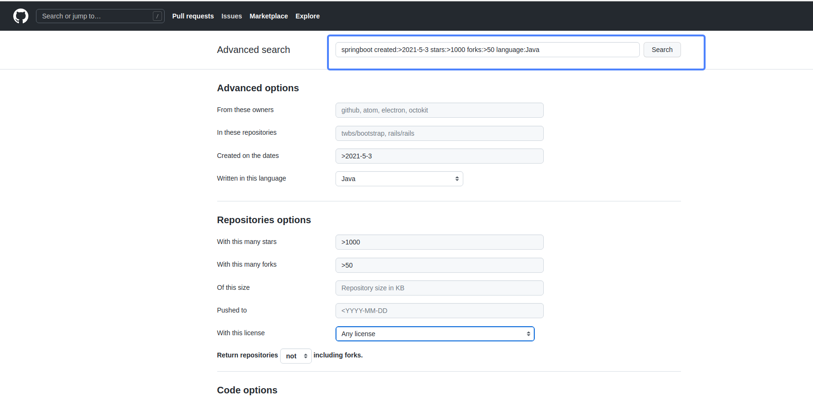
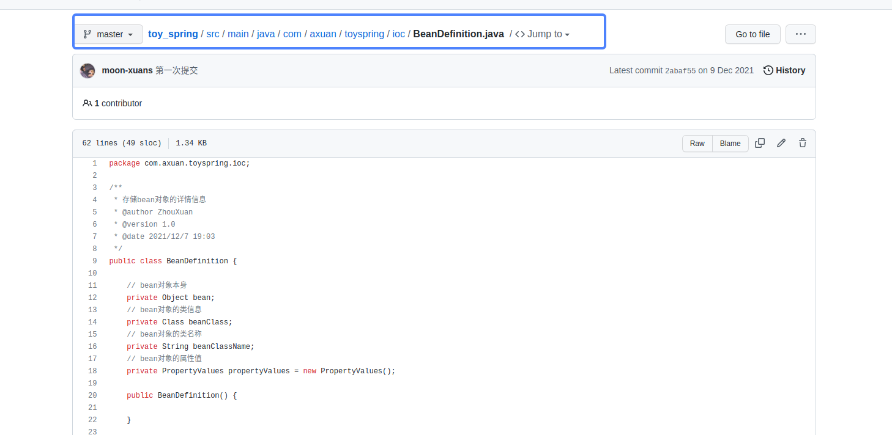
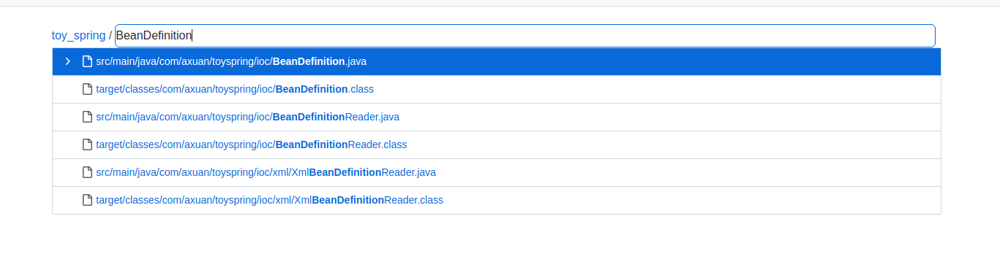
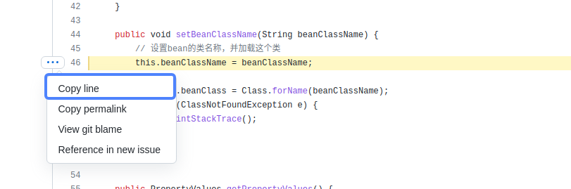
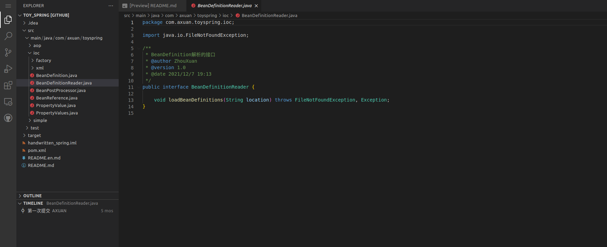

## 如何使用github
### 1.搜索功能
通过普通的方式，搜索项目，可能系统推荐的不是最优的。因此，可以使用github的高级搜索功能，进行更加全面的搜索。

在下面的表单中填写后，会自动生成搜索的语法。
### 2.查找文件
#### 2.1.快速查找文件
一般查找文件，可能需要一直点击很多层，并且找不到，可能需要回到上一级目录，影响效率，类似这样。

而github自带的工具，按't'键，会有一个搜索框，输入要找文件，则可以直接找到。

#### 2.2.快速定位行数
按'l',有一个搜索框，输入行数，可以直接定位到。

#### 2.3.快速复制
找到对应行号，点击行号，有一些选项，可以快速复制该行。

### 3.阅读代码技巧
一般阅读代码的时候，需要下载到本地后，再查看，很影响效率，因此可以按'.'键，会直接生成一个web端的vscode，供阅读代码。

### 4.在线运行项目
在项目地址前加上'gitpod.io/#/'前缀，可以生成一个远程的编译工具。
上面有所有的环境，并且可以直接运行。

### 5.项目推送
github中的explore栏目，有一个Get email updates按钮，进去后可以选择邮件推送，github可以定期推送一些你喜欢的项目。
